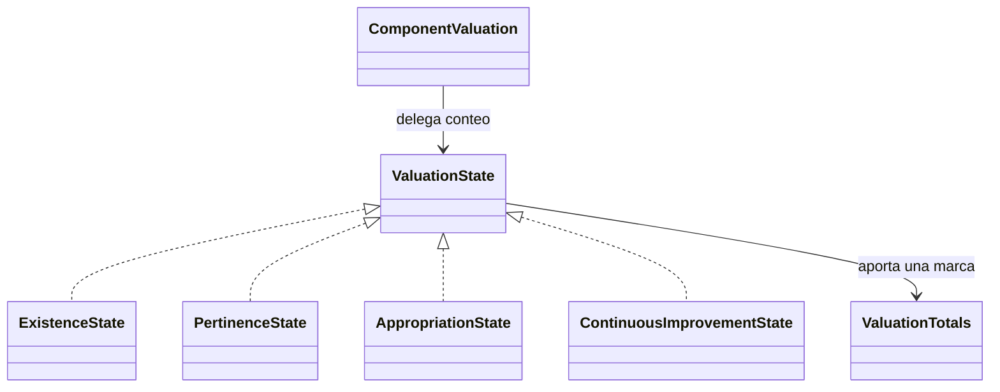

# Valoración manual de componentes y patrón State

Decisión confirmada por Juan el 6 de octubre de 2026: la institución elige el estado de cada componente a partir de su autoevaluación. Se revisó directamente el archivo local `24. IEM CIUDADELA EDUCATIVA PASTO AUTOEV 2025 Y PMI 2026-2028 G. ACADEMICA.xlsx`, hoja **Anexo 1**: se coloca una marca `1` en una de las cuatro columnas y se cuentan las marcas por estado. Juan confirmó que el formato actualizado conserva evidencias, fortalezas, oportunidades y porcentajes; el catálogo vigente es el de 2026 cargado por V6, no el catálogo anterior del Excel.

## Estados y persistencia

| Código `level` en BD/API | Estado en API | Nombre mostrado |
| --- | --- | --- |
| 1 | `EXISTENCE` | Existencia |
| 2 | `PERTINENCE` | Pertinencia |
| 3 | `APPROPRIATION` | Apropiación |
| 4 | `CONTINUOUS_IMPROVEMENT` | Mejoramiento continuo |

La [Guía 34 de 2026](https://www.mineducacion.gov.co/1780/articles-430002_recurso_3.pdf), anexo 1 (pp. 115-163), describe los cuatro niveles por componente; el anexo 2 (pp. 164-167) presenta la matriz con columnas 1–4 y totales. Los números conservan la correspondencia con esos niveles y el contrato existente. La marca `1` del Excel significa un componente contado en la columna elegida, independientemente del código del estado.

La institución puede seleccionar cualquiera de los estados directamente y corregir su elección en el borrador. Un componente sin valoración guardada permanece pendiente y no se asigna automáticamente a Existencia. La selección y las evidencias se guardan mediante el PUT existente. Los códigos numéricos guardados anteriormente se reconstruyen como objetos State, manteniendo sus valores; no cambia el esquema ni las migraciones aplicadas.

## Implementación State

`ComponentValuation` es el contexto. Mantiene su `ValuationState` transitorio y delega en él la aportación al conteo y la clasificación como oportunidad o fortaleza. `ExistenceState`, `PertinenceState`, `AppropriationState` y `ContinuousImprovementState` implementan la interfaz: cada una devuelve su `ComponentValue` y aumenta exclusivamente su propio contador. `ValuationState.fromLevel` reconstruye el objeto a partir del código persistido y rechaza valores ajenos a los cuatro estados.

Se contrastó el [diagrama de clases de la wiki](https://github.com/edben110/AutoevaluacionYPMI/wiki/Link-Diagrama-de-clases): el modelo propone una interfaz `ValueState` con `getValue()`, `isImprovementChance()` e `isStrength()`, implementada aquí como `ValuationState`. Existencia y Pertinencia devuelven oportunidad de mejora; Apropiación y Mejoramiento continuo devuelven fortaleza. Esa clasificación se deriva del estado que ya eligió la institución; mantiene la elección manual.



Ejemplo de solicitud, elegida por la institución:

```json
{"level":3,"evidenceUrl":"https://ejemplo.org/evidencia","evidenceNote":"Evidencia revisada por la institución","strengths":"Planeación articulada entre docentes","improvementOpportunities":"Mejorar el seguimiento a los acuerdos"}
```

La respuesta conserva `level` y añade `state: "APPROPRIATION"`, `stateLabel: "Apropiación"`, `improvementChance: false` y `strength: true`. Consultar o crear el borrador devuelve sus `valuations` y el campo `totals`. Para seis componentes con estados 1, 3, 1, 4, 2 y 3:

```json
{"existence":2,"pertinence":1,"appropriation":2,"continuousImprovement":1,"total":6,"percentages":{"existence":33.33,"pertinence":16.67,"appropriation":33.33,"continuousImprovement":16.67}}
```

Los totales se reconstruyen con las valoraciones guardadas en cada consulta. Una corrección de Existencia a Mejoramiento continuo mueve un componente entre columnas, sin duplicarlo. Tampoco se suman los códigos 1–4 como si fueran cantidades.

Vue muestra los nombres y calcula subtotales por proceso y totales del área seleccionada con las valoraciones guardadas de los componentes del catálogo visible. La API mantiene el total anual del borrador, que incluye todas sus valoraciones, también las de componentes posteriormente desactivados; ese total global no se mezcla con el resumen de una sola área. Los cambios pendientes del formulario y los intentos de guardado fallidos no alteran el conteo. Las tablas usan HTML, bordes, encabezados y filas de porcentajes diferenciadas; Juan autorizó un diseño modesto provisional y un verde más fuerte en los encabezados de procesos. El diseño definitivo sigue pendiente del manual de imagen.

El espacio de la institución ofrece cuatro entradas, una por área del catálogo, y cada una abre `/autoevaluacion/:areaId`. Solo se muestran procesos y componentes del área elegida; su indicador de avance también usa exclusivamente esos componentes. La separación corresponde a formularios y navegación: se conserva la entidad anual `SelfEvaluation` y cada valoración continúa vinculada a su componente. No se duplican ni migran respuestas para generar cuatro registros independientes. La ruta anterior `/autoevaluacion` vuelve al espacio donde se elige el área.

## Fortalezas, oportunidades y porcentajes

`strengths` e `improvementOpportunities` son textos institucionales independientes de `evidenceNote` y de las futuras observaciones de Secretaría. Son opcionales en el borrador, admiten hasta 10.000 caracteres cada uno y se guardan junto con la valoración. Se recortan espacios exteriores y los valores vacíos se almacenan como `NULL`. El PUT reemplaza los campos: enviarlos vacíos, nulos u omitirlos los borra. V7 agrega las dos columnas sin alterar estados ni evidencias anteriores; las valoraciones existentes comienzan con ambos textos en `NULL`.

La hoja anterior incluye ambos textos en todos los componentes. Juan confirmó posteriormente, el 6 de octubre de 2026, la siguiente regla para el sistema actual; su aclaración prevalece sobre ese ejemplo:

| Estado | Admite fortalezas | Admite oportunidades de mejora |
| --- | --- | --- |
| Existencia | No | Sí |
| Pertinencia | Sí | Sí |
| Apropiación | Sí | Sí |
| Mejoramiento continuo | Sí | No |

La aptitud está implementada en State mediante `allowsStrengths()` y `allowsImprovementOpportunities()`. La API devuelve `strengthsAllowed` e `improvementOpportunitiesAllowed` y rechaza con `400` los textos no vacíos prohibidos por el estado elegido, antes de modificar la valoración. Los campos permitidos siguen siendo opcionales en `DRAFT`; no hay envío formal que exija completarlos todavía.

Vue deshabilita el campo no permitido. Si ya contiene texto al cambiar de estado o al cargar un registro anterior, lo conserva visible y ofrece **Quitar fortaleza** o **Quitar oportunidad de mejora**. Cambiar el estado no borra textos automáticamente. Quitar un texto cambia el formulario; solo **Guardar valoración** persiste su eliminación. La consulta de registros anteriores no los modifica y no se aplica una migración que borre respuestas.

`strength` e `improvementChance` conservan la clasificación del diagrama para el análisis posterior del PMI, donde los candidatos propuestos son 1/2. La nueva aptitud de diligenciamiento permite ambos textos en 2/3 y se expone por separado; no amplía por sí sola la selección de componentes críticos.

El porcentaje se calcula como `conteo del estado / total de valoraciones guardadas del grupo × 100`, redondeado a dos decimales. Se presenta por proceso y área en cada formulario y por borrador anual en la API; no mide el avance de diligenciamiento. Sin valoraciones se muestra 0 % en todos los estados. Los redondeos independientes pueden sumar 99,99 % o 100,01 %. Ejemplo verificado en Anexo 1, filas 34–35: 0, 4, 11 y 3 componentes sobre 18 producen 0 %, 22,22 %, 61,11 % y 16,67 %.

## Relación con los componentes críticos del PMI

El diagrama de clases y el de flujo identifican los estados 1/2 como oportunidades de mejoramiento y los estados 3/4 como fortalezas. State ya expone esta clasificación. Se conservan componente, estado y evidencias individuales para fundamentar la decisión; un subtotal solo muestra cuántos están en cada nivel.

La guía describe el análisis de oportunidades y factores críticos en las pp. 77-80. En la p. 80 propone valorar urgencia, tendencia e impacto en escala 1–5 y ordenar por su suma. Esa valoración corresponde a la priorización posterior, distinta de los códigos 1–4 de la autoevaluación.

Queda por implementar `PrioritaryComponent`, con su referencia a `ComponentValuation`, factores críticos y valores de urgencia/tendencia/impacto, según el diagrama. La selección final de componentes para el PMI requiere confirmar los detalles del límite propuesto en el flujo del equipo. La implementación actual expone valoración manual, clasificación y conteo; el módulo de priorización sigue pendiente.
