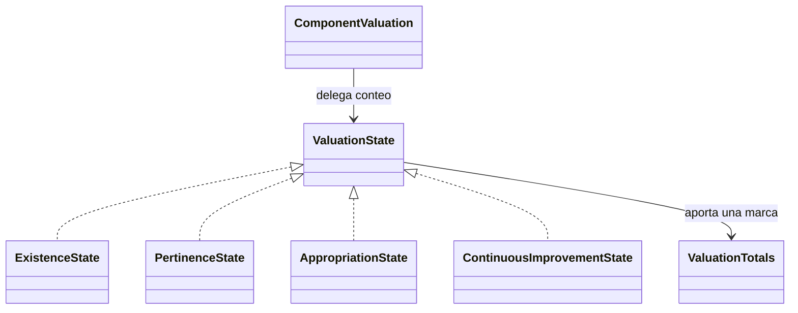

# Valoración manual de componentes y patrón State

Decisión confirmada por Juan el 6 de octubre de 2026: la institución elige el estado de cada componente a partir de su autoevaluación. En el Excel descrito se coloca una marca `1` en una de las cuatro columnas y se cuentan las marcas por estado. El archivo Excel aún no se ha revisado directamente.

## Estados y persistencia

| Código `level` en BD/API | Estado en API | Nombre mostrado |
| --- | --- | --- |
| 1 | `EXISTENCE` | Existencia |
| 2 | `PERTINENCE` | Pertinencia |
| 3 | `APPROPRIATION` | Apropiación |
| 4 | `CONTINUOUS_IMPROVEMENT` | Mejoramiento continuo |

La [Guía 34 de 2026](https://www.mineducacion.gov.co/1780/articles-430002_recurso_3.pdf), anexo 1 (pp. 115-163), describe los cuatro niveles por componente; el anexo 2 (pp. 164-167) presenta la matriz con columnas 1–4 y totales. Los números conservan la correspondencia con esos niveles y el contrato existente. La marca `1` del Excel significa un componente contado en la columna elegida, independientemente del código del estado.

La institución puede seleccionar cualquiera de los estados directamente y corregir su elección en el borrador. Un componente sin valoración guardada permanece pendiente y no se asigna automáticamente a Existencia. La selección y las evidencias se guardan mediante el PUT existente. Los códigos numéricos guardados anteriormente se reconstruyen como objetos State, manteniendo sus valores; no cambia el esquema ni las migraciones aplicadas.

## Implementación State

`ComponentValuation` es el contexto. Mantiene su `ValuationState` transitorio y delega en él la aportación al conteo. `ExistenceState`, `PertinenceState`, `AppropriationState` y `ContinuousImprovementState` implementan la interfaz: cada una conoce su código/etiqueta y aumenta exclusivamente su propio contador. `ValuationState.fromLevel` reconstruye el objeto a partir del código persistido y rechaza valores ajenos a los cuatro estados.



Ejemplo de solicitud, elegida por la institución:

```json
{"level":3,"evidenceUrl":"https://ejemplo.org/evidencia","evidenceNote":"Evidencia revisada por la institución"}
```

La respuesta conserva `level` y añade `state: "APPROPRIATION"` y `stateLabel: "Apropiación"`. Consultar o crear el borrador devuelve sus `valuations` y el campo `totals`. Para seis componentes con estados 1, 3, 1, 4, 2 y 3:

```json
{"existence":2,"pertinence":1,"appropriation":2,"continuousImprovement":1,"total":6}
```

Los totales se reconstruyen con las valoraciones guardadas en cada consulta. Una corrección de Existencia a Mejoramiento continuo mueve un componente entre columnas, sin duplicarlo. Tampoco se suman los códigos 1–4 como si fueran cantidades.

Vue muestra los nombres y calcula subtotales por proceso y totales por área con las valoraciones guardadas de los componentes del catálogo visible. El total del borrador incluye todas sus valoraciones, también las de componentes posteriormente desactivados. Los cambios pendientes del formulario y los intentos de guardado fallidos no alteran el conteo. Las tablas usan HTML y estilos existentes; el diseño definitivo está pendiente del manual de imagen del equipo.

## Relación con los componentes críticos del PMI

Los estados bajos pueden aportar candidatos para identificar oportunidades de mejoramiento. Se conservan componente, estado y evidencias individuales para fundamentar la decisión; un subtotal solo muestra cuántos están en cada nivel.

La guía describe el análisis de oportunidades y factores críticos en las pp. 77-80. En la p. 80 propone valorar urgencia, tendencia e impacto en escala 1–5 y ordenar por su suma. Esa valoración corresponde a la priorización posterior, distinta de los códigos 1–4 de la autoevaluación.

Quedan por confirmar con el equipo qué estados generan candidatos, si se incluyen todos los componentes de esos estados y cómo se conecta la selección con urgencia/tendencia/impacto. La implementación actual termina en valoración manual y conteo; el módulo de priorización sigue pendiente.
